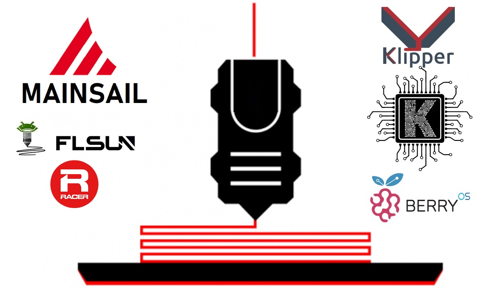
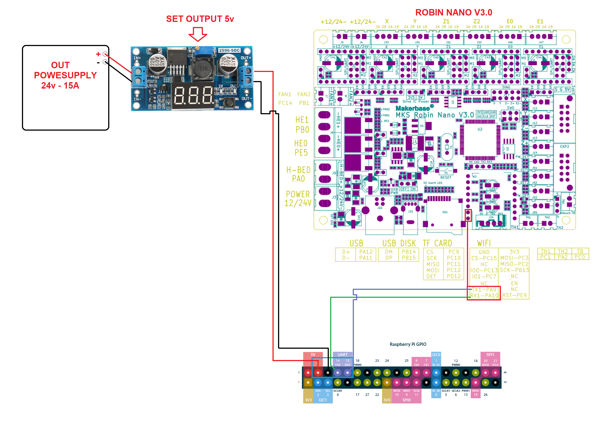

# Klipper + MAINSAIL >> FLSUN_SR

################### HW MOD ####################
+ Raspberry Pi 3B
+ Display IPS Capacitive 4.3"

################### SW MOD #####################
- Klipper v0.10.x
- MainSail  v2.1.2
- Moonraker v0.7.1-x
- KlipperScreen v0.2.x

##################   Optional by KIAUH   #################

URL: https://github.com/th33xitus/kiauh

###############################################


# Install Klipper FLSUN SR:

 PREREQUISITES:
> Raspberry 
> Optional Display 
> Elettrical connection:


# STEP 1:
- Install Mainsail OS 
-     > https://github.com/mainsail-crew/MainsailOS/releases
-     > Guide: https://3dprintbeginner.com/how-to-install-mainsailos-on-raspberry-pi/

# STEP 2:
- SSH IP Raspberry (User/pwd > pi/raspberry)
- Launch commands:
```
cd klipper
make menuconfig
```
- ############################### SETTINGS ##############################
```
      > Micro-controller Architecture (STMicroelectronics STM32)  --->
      > Processor model (STM32F407)  --->
      > Bootloader offset (48KiB bootloader (MKS Robin Nano V3))  --->
      > Clock Reference (8 MHz crystal)  --->
      > Communication interface (Serial (on USART1 PA10/PA9))  --->
      > (250000) Baud rate for serial port
```
- Q > Yes
- Command: 
```
make
```
- copy generate file: /home/pi/klipper/out/klipper.bin in new SDCARD and rename in: Robin_nano_v3 (you can find it among the files here]

# STEP 3:
- Insert sdcard in the nano robin and wait and power-on SR
- Restart SR

# STEP 4:
- Open mainsail from browser
- leftmenu > Machine > edit printer.cfg :
```
[mcu]
serial: /dev/ttyAMA0
restart_method: command
baud: 250000
```
  
# NOTE:
- Serial port check: open ssh raspberry e launch command: 
```
ls /dev/ttyAMA*
```


